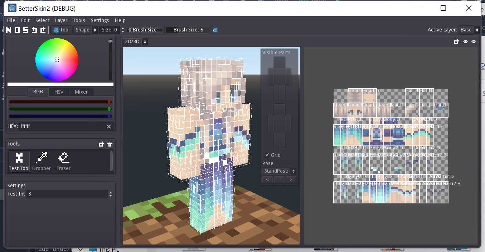

# BetterSkin2
BetterSkin2 aims to be a feature-rich, customizable and easy-to-use Minecraft skin editor.

*BetterSkin is my previous c++ project, which is unfinished, so this project is called BetterSkin2*

**This project is not production ready yet**

Some dev screenshots:

## Why another skin editor
There are a lot of MC skin editor out there, but each of them have some issues including:
- Only available online
- Lack modern features that other drawing softwares provide
- Not customizable
- Some are not maintained anymore

Solving these problems is the primary goal of this project.

## Planned Features
**Main features**
- customizable pen tools
- convinient color picker
- supports layers
- reigon selections, copy/paste, transformation
- 3D view
- in-window reference images
- supports higher resolution

**Additional (less prioritized) features**
- switch camera mode
- grease pencil like blender
- advanced color mixer
- format converting
- filters/effects
- plugins
- paint custom models

## Contribute
This projects is still in its early stage, many api/structure may change.

Contribution is welcomed, simply start a pull request.

You can also submit bug reports or feature request in the issues tab.

## TODOs
Below are some current todo list. Begin with some simple ones to become familiar with the project.

- undo redo
- settings manager
- select&move tool
- add color palette, color mix/gradient generator, palette from image/palette to image, fill with palette etc.
- add region in skins, region fill, auto shadows, mirror, region select etc.
- add noise tool
- region clip option for pen tool
- add support for custom shortcut keys for tool switching & quick tools
- support higher resolution
- add new skin menu
- better appearance
- let 2d camera scale around mouse instead of screen center
- alpha/strength support for tools
